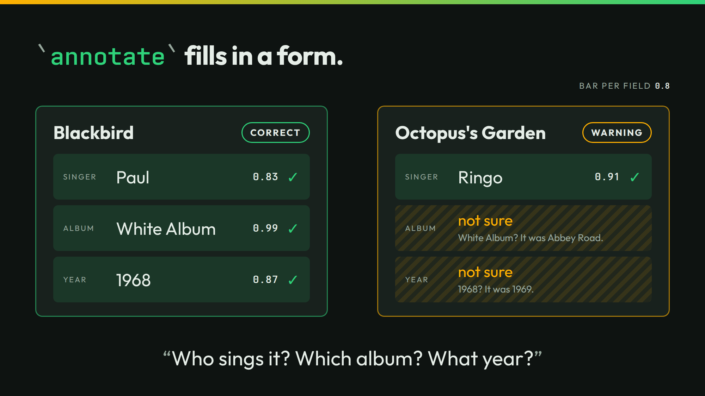

# annotate



The slide fills in a form for two songs: the singer, the first album, and the year. The card `annotate-cold-card.json` holds the three questions and a bar of `0.8` for each field.

## Run it

```sh
./run
```

```json
{"song":"Blackbird","value":{"singer":"Paul","album":"White Album","year":"1968"},"p":{"singer":{"John":0.15,"Paul":0.83,"George":0.02,"Ringo":0.0},"album":{"Help!":0.0,"Rubber Soul":0.0,"Revolver":0.01,"White Album":0.99,"Abbey Road":0.0},"year":{"1965":0.0,"1966":0.01,"1967":0.09,"1968":0.87,"1969":0.03}}}
{"song":"Octopus's Garden","value":{"singer":"Ringo","album":null,"year":null},"p":{"singer":{"John":0.0,"Paul":0.01,"George":0.08,"Ringo":0.91},"album":{"Help!":0.0,"Rubber Soul":0.0,"Revolver":0.36,"White Album":0.6,"Abbey Road":0.04},"year":{"1965":0.0,"1966":0.04,"1967":0.29,"1968":0.6,"1969":0.07}}}
```

`./run threshold 0.5` sets every field's bar to 0.5:

```sh
./run threshold 0.5
```

```json
{"song":"Blackbird","value":{"singer":"Paul","album":"White Album","year":"1968"},"p":{"singer":{"John":0.15,"Paul":0.83,"George":0.02,"Ringo":0.0},"album":{"Help!":0.0,"Rubber Soul":0.0,"Revolver":0.01,"White Album":0.99,"Abbey Road":0.0},"year":{"1965":0.0,"1966":0.01,"1967":0.09,"1968":0.87,"1969":0.03}}}
{"song":"Octopus's Garden","value":{"singer":"Ringo","album":"White Album","year":"1968"},"p":{"singer":{"John":0.0,"Paul":0.01,"George":0.08,"Ringo":0.91},"album":{"Help!":0.0,"Rubber Soul":0.0,"Revolver":0.36,"White Album":0.6,"Abbey Road":0.04},"year":{"1965":0.0,"1966":0.04,"1967":0.29,"1968":0.6,"1969":0.07}}}
```

`./run live` asks your own server. It sends 2 calls.

## The lessons

- **You control the bar.** At `0.8`, Octopus's Garden leaves its album and year empty. At `0.5`, it fills them with White Album and 1968. Both are wrong. The song came out on Abbey Road in 1969.
- **The number is the number.** The album guess is White Album at 0.6. The model says it is unsure. The bar of `0.8` hears that and leaves the field empty.

## The files

- `annotate-cold.jsonl` and `annotate-context.jsonl`: the cases, cold and with each song's catalog entry.
- `annotate-cold-card.json` and `annotate-context-card.json`: the forms.
- `outputs.jsonl`, `timing.tsv`, and `recording/`: the recorded answers.
- `run.txt`: the thinkthen build and the model that recorded the answers. Replayed under thinkthen 0.1.0, `checkpoint/surfaces/2026-10-02-1` (`4e880cdf6`), on 2026-10-02: no answer changed.

The talk's page for this slide: [thinkthen.dev/learn/beatles-bench/annotate](https://thinkthen.dev/learn/beatles-bench/annotate/).
