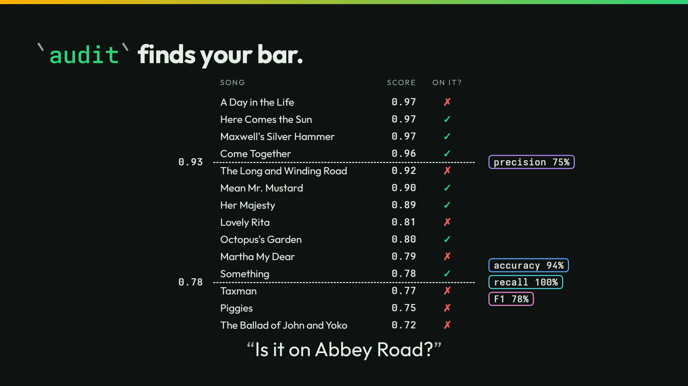

# audit



The slide grades 70 answers to one question: "Is this song on the album Abbey Road?" `audit` compares them with `key.jsonl`. It suggests the bar that makes the fewest mistakes.

## Run it

```sh
./run
```

```text
Is this song on the album Abbey Road?  (decide, 70 rows, 70 labeled, 0 failed, rule as run)
  agreement 0.714 (95% 0.599 to 0.807): 50 right, 20 wrong, 0 unresolved, 0 tied
  said yes, key no: 20   said no, key yes: 0   yes recall 1.000   mean p(yes) 0.443   AUC 0.971
  calibration error 0.343 (95% 0.293 to 0.406); the interval resamples the records; it does not cover rerun noise, so compare two runs of the same records
  suggested cut 0.78 (most agreement on the tuning part; seeded split, tuned on 35, checked on 35 held out): held agreement 0.771 as run -> 0.943 at the cut, yes recall 1.000 -> 1.000
    cut  threshold  answered coverage accuracy
    0.5  0.5              70    1.000    0.714
   0.55  0.45:0.55        63    0.900    0.730
    0.6  0.4:0.6          55    0.786    0.782
   0.65  0.35:0.65        46    0.657    0.804
    0.7  0.3:0.7          37    0.529    0.811
   0.75  0.25:0.75        30    0.429    0.800
    0.8  0.2:0.8          23    0.329    0.870
   0.85  0.15:0.85        17    0.243    0.882
    0.9  0.1:0.9          13    0.186    0.846
   0.95  0.05:0.95         6    0.086    0.833
    1.0  0:1               0    0.000        -
```

At the suggested cut:

```sh
./run threshold 0.78 | head -2
```

```text
Is this song on the album Abbey Road?  (decide, 70 rows, 70 labeled, 0 failed, rule 0.78)
  agreement 0.943 (95% 0.862 to 0.978): 66 right, 4 wrong, 0 unresolved, 0 tied
```

`./run threshold` also takes a band such as `0.3:0.7`.

`./run live` asks your own server. It sends 70 calls.

## The lessons

- **You control the bar.** At `0.5`, 50 of 70 are right. At the suggested cut of `0.78`, 66 are.
- **The number is the number.** The answers do not change. audit sends no request. It reads the same 70 numbers at another bar. An AUC of 0.971 says the numbers sort the songs well. The bar was the problem.

## The files

- `audit-cold.jsonl` and `audit-context.jsonl`: the 70 cases, cold and with each song's catalog entry.
- `key.jsonl`: the right answers, from `data/songs.tsv`.
- `rows.jsonl`, `rows-context.jsonl`, and `audit-*.json`: the answers and audit's reports.
- `outputs.jsonl`, `timing.tsv`, and `recording/`: the recorded answers.
- `run.txt`: the thinkthen build and the model that recorded the answers.

The talk's page for this slide: [thinkthen.dev/learn/beatles-bench/audit](https://thinkthen.dev/learn/beatles-bench/audit/).
