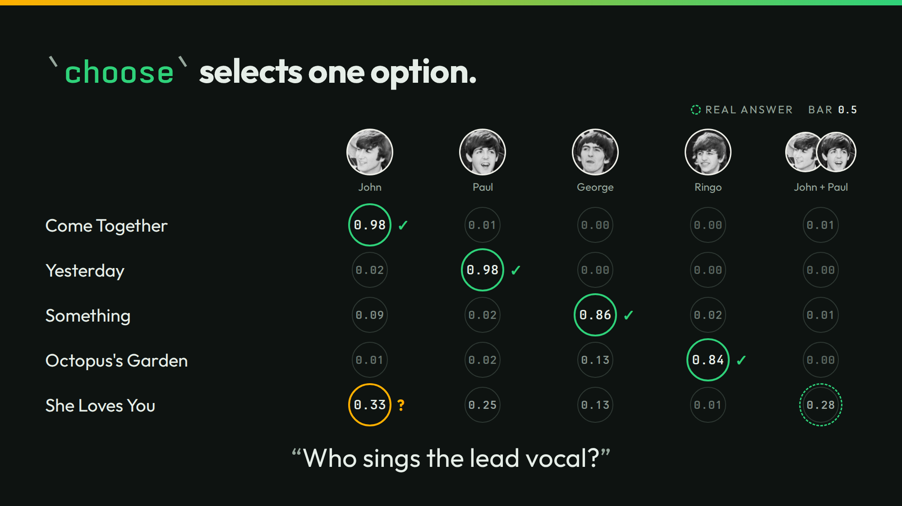

# choose



The slide asks who sings the lead vocal on five songs. `choose` picks one option and gives every option a probability.

## Run it

```sh
./run
```

```json
{"song":"Come Together","value":"John","p":{"John":0.98,"Paul":0.01,"George":0.0,"Ringo":0.0,"John and Paul duet":0.01}}
{"song":"Yesterday","value":"Paul","p":{"John":0.02,"Paul":0.98,"George":0.0,"Ringo":0.0,"John and Paul duet":0.0}}
{"song":"Something","value":"George","p":{"John":0.09,"Paul":0.02,"George":0.86,"Ringo":0.02,"John and Paul duet":0.01}}
{"song":"Octopus's Garden","value":"Ringo","p":{"John":0.01,"Paul":0.02,"George":0.13,"Ringo":0.84,"John and Paul duet":0.0}}
{"song":"She Loves You","value":"John","p":{"John":0.33,"Paul":0.25,"George":0.13,"Ringo":0.01,"John and Paul duet":0.28}}
```

With a bar, a pick under it reads null, as not sure:

```sh
./run threshold 0.5
```

```json
{"song":"Come Together","value":"John","p":{"John":0.98,"Paul":0.01,"George":0.0,"Ringo":0.0,"John and Paul duet":0.01}}
{"song":"Yesterday","value":"Paul","p":{"John":0.02,"Paul":0.98,"George":0.0,"Ringo":0.0,"John and Paul duet":0.0}}
{"song":"Something","value":"George","p":{"John":0.09,"Paul":0.02,"George":0.86,"Ringo":0.02,"John and Paul duet":0.01}}
{"song":"Octopus's Garden","value":"Ringo","p":{"John":0.01,"Paul":0.02,"George":0.13,"Ringo":0.84,"John and Paul duet":0.0}}
{"song":"She Loves You","value":null,"p":{"John":0.33,"Paul":0.25,"George":0.13,"Ringo":0.01,"John and Paul duet":0.28}}
```

`./run live` asks your own server. It sends 5 calls.

## The lessons

- **You control the bar.** With no bar, She Loves You gets John. At `0.5` it gets null.
- **The number is the number.** She Loves You splits between John at 0.33, the duet at 0.28, and Paul at 0.25. The right answer is the duet. The split says the model does not know.

## The files

- `choose-cold.jsonl` and `choose-context.jsonl`: the cases, cold and with each song's catalog entry.
- `outputs.jsonl`, `timing.tsv`, and `recording/`: the recorded answers.
- `run.txt`: the thinkthen build and the model that recorded the answers. Replayed under `thinkthen 0.1.0`, `checkpoint/surfaces/2026-10-02-1` (`4e880cdf6`), on 2026-10-02: no answer changed.

The talk's page for this slide: [thinkthen.dev/learn/beatles-bench/choose](https://thinkthen.dev/learn/beatles-bench/choose/).
