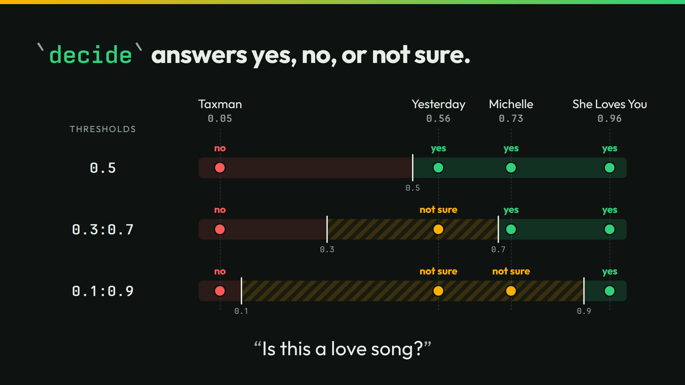

# decide



The slide asks one yes or no question of four song titles: "It is a love song." `decide` gives the probability of yes. A bar turns it into yes, no, or not sure.

## Run it

```sh
./run
```

```json
{"song":"She Loves You","value":true,"yes":0.96}
{"song":"Michelle","value":true,"yes":0.73}
{"song":"Yesterday","value":true,"yes":0.56}
{"song":"Taxman","value":false,"yes":0.05}
```

A band reads its middle as not sure:

```sh
./run threshold 0.3:0.7
```

```json
{"song":"She Loves You","value":true,"yes":0.96}
{"song":"Michelle","value":true,"yes":0.73}
{"song":"Yesterday","value":null,"yes":0.56}
{"song":"Taxman","value":false,"yes":0.05}
```

`./run live` asks your own server. It sends 4 calls.

## The lessons

- **You control the bar.** Yesterday reads yes at the default bar of `0.5`. It reads not sure under the band `0.3:0.7`.
- **The number is the number.** Yesterday sits at 0.56 under both. The bar changes what you do with the number. It never changes the number.

## The files

- `decide-love.jsonl`: the slide's four cases.
- `decide-cold.jsonl` and `decide-context.jsonl`: six songs asked about Abbey Road, cold and with each song's catalog entry.
- `outputs.jsonl`, `timing.tsv`, and `recording/`: the recorded answers.
- `run.txt`: the thinkthen build and the model that recorded the answers. Replayed under `thinkthen 0.1.0`, `checkpoint/surfaces/2026-10-02-1` (`4e880cdf6`), on 2026-10-02: no answer changed.

The talk's page for this slide: [thinkthen.dev/learn/beatles-bench/decide](https://thinkthen.dev/learn/beatles-bench/decide/).
