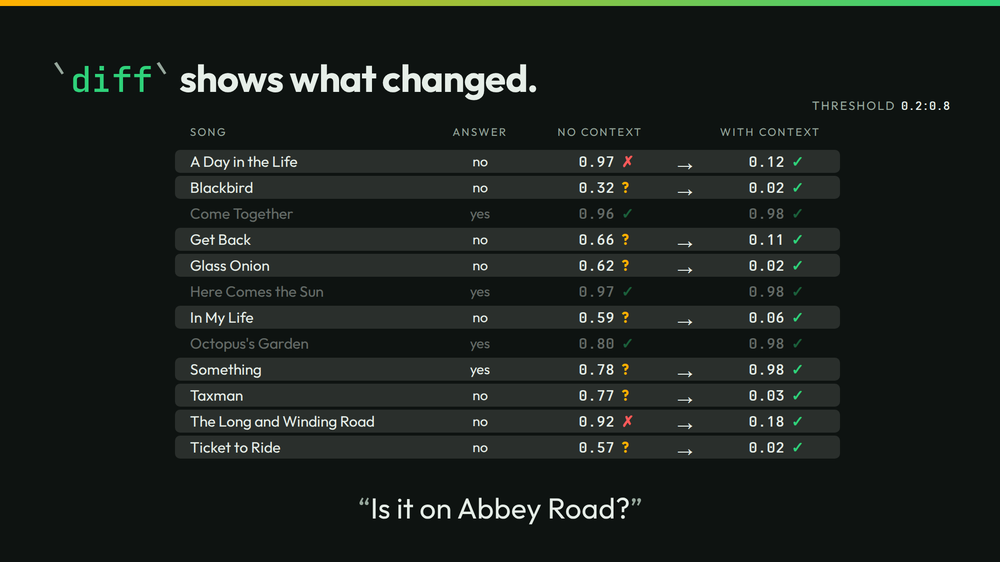

# diff



The slide compares two runs of the same 70 songs: cold, and with each song's catalog entry. `diff` lists the answers that change. It marks each one against the key.

## Run it

```sh
./run
```

```text
A Day in the Life  yes -> no  p 0.97 -> 0.12  key no: gained
The Long and Winding Road  yes -> no  p 0.92 -> 0.18  key no: gained
Martha My Dear  yes -> no  p 0.79 -> 0.02  key no: gained
Piggies  yes -> no  p 0.75 -> 0.02  key no: gained
Lovely Rita  yes -> no  p 0.81 -> 0.02  key no: gained
The Ballad of John and Yoko  yes -> no  p 0.72 -> 0.33  key no: gained
Get Back  yes -> no  p 0.66 -> 0.11  key no: gained
Good Night  yes -> no  p 0.52 -> 0.02  key no: gained
In My Life  yes -> no  p 0.59 -> 0.06  key no: gained
Julia  yes -> no  p 0.64 -> 0.02  key no: gained
Taxman  yes -> no  p 0.77 -> 0.03  key no: gained
Back in the U.S.S.R.  yes -> no  p 0.58 -> 0.02  key no: gained
Don't Pass Me By  yes -> no  p 0.67 -> 0.02  key no: gained
Glass Onion  yes -> no  p 0.62 -> 0.02  key no: gained
Penny Lane  yes -> no  p 0.58 -> 0.06  key no: gained
Eleanor Rigby  yes -> no  p 0.52 -> 0.04  key no: gained
Let It Be  yes -> no  p 0.51 -> 0.10  key no: gained
Ob-La-Di, Ob-La-Da  yes -> no  p 0.57 -> 0.02  key no: gained
Michelle  yes -> no  p 0.63 -> 0.03  key no: gained
Ticket to Ride  yes -> no  p 0.57 -> 0.02  key no: gained
A -> B (at 0.5 and 0.5): 20 of 70 changed; yes -> no 20; gained 20, lost 0 (50 -> 70 right of 70); McNemar p 0.000 on right answers
```

The slide reads both runs at a band:

```sh
./run threshold 0.2:0.8 | tail -1
```

```text
A -> B (at 0.2:0.8 and 0.2:0.8): 48 of 70 changed; unresolved -> no 44; yes -> no 3; unresolved -> yes 1; gained 3, lost 0 (20 -> 68 right of 70); McNemar p 0.250 on right answers
```

`./run live` asks your own server. It sends 140 calls.

## The lessons

- **You control the bar.** At `0.5`, 20 of 70 answers change. Under the band `0.2:0.8`, 48 change. Most go from not sure to right.
- **The number is the number.** A Day in the Life goes from 0.97 to 0.12. The catalog entry changed the number. The bar only reads it.

## The files

- `diff.jsonl`: the committed comparison at `0.5`.
- The answers, the recording, and the key are in [`../audit`](../audit/).

The talk's page for this slide: [thinkthen.dev/learn/beatles-bench/diff](https://thinkthen.dev/learn/beatles-bench/diff/).
