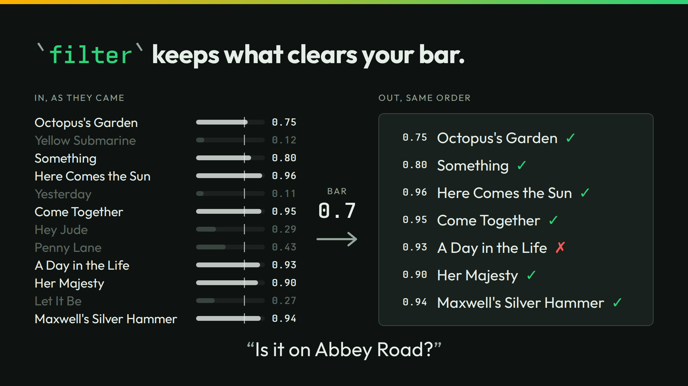

# filter



The slide keeps the songs on Abbey Road out of twelve. `filter` keeps each song whose probability of yes reaches the bar. The slide's bar is `0.7`.

## Run it

```sh
./run
```

```json
{"kept":"Octopus's Garden","yes":0.75}
{"kept":"Something","yes":0.8}
{"kept":"Here Comes the Sun","yes":0.96}
{"kept":"Come Together","yes":0.95}
{"kept":"A Day in the Life","yes":0.93}
{"kept":"Her Majesty","yes":0.9}
{"kept":"Maxwell's Silver Hammer","yes":0.94}
```

A higher bar keeps fewer songs:

```sh
./run threshold 0.9
```

```json
{"kept":"Here Comes the Sun","yes":0.96}
{"kept":"Come Together","yes":0.95}
{"kept":"A Day in the Life","yes":0.93}
{"kept":"Her Majesty","yes":0.9}
{"kept":"Maxwell's Silver Hammer","yes":0.94}
```

`./run live` asks your own server. It sends 12 calls.

## The lessons

- **You control the bar.** At `0.7`, seven songs pass. At `0.9`, five pass. Octopus's Garden at 0.75 and Something at 0.8 drop out.
- **The number is the number.** A Day in the Life passes at 0.93. It is not on Abbey Road. No bar fixes a miss this sure. The catalog entry fixes it.

## The files

- `filter-cold.jsonl` and `filter-context.jsonl`: the cases, cold and with each song's catalog entry.
- `lists/`: the kept songs of each run.
- `outputs.jsonl`, `timing.tsv`, and `recording/`: the recorded answers.
- `run.txt`: the thinkthen build and the model that recorded the answers. Replayed under thinkthen 0.1.0, `checkpoint/surfaces/2026-10-02-1` (`4e880cdf6`), on 2026-10-02: no answer changed.

The talk's page for this slide: [thinkthen.dev/learn/beatles-bench/filter](https://thinkthen.dev/learn/beatles-bench/filter/).
