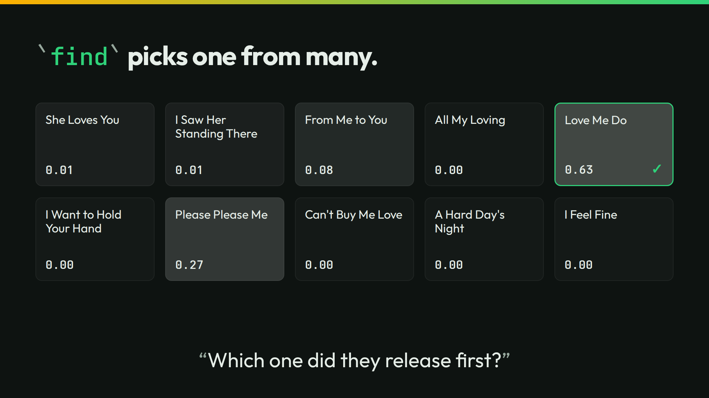

# find



The slide asks which of ten songs the Beatles released first. `find` picks one line and gives every line a probability.

## Run it

```sh
./run
```

```json
{"pick":"Love Me Do","p":0.63}
```

find has no bar of its own. Here `jq` applies one. A pick under the bar reads null, as not sure:

```sh
./run threshold 0.7
```

```json
{"pick":null,"p":0.63}
```

`./run live` asks your own server. It sends one call.

## The lessons

- **You control the bar.** Love Me Do is the pick at 0.63. At `0.7`, your program calls it not sure.
- **The number is the number.** Love Me Do is right, at 0.63. Right and sure are two different things. The number tells you how sure.

## The files

- `find-cold.jsonl` and `find-context.jsonl`: the cases, cold and with each song's catalog entry.
- `outputs.jsonl`, `timing.tsv`, and `recording/`: the recorded answers.
- `run.txt`: the thinkthen build and the model that recorded the answers. Replayed under thinkthen 0.1.0, `checkpoint/surfaces/2026-10-02-1` (`4e880cdf6`), on 2026-10-02: no answer changed.

The talk's page for this slide: [thinkthen.dev/learn/beatles-bench/find](https://thinkthen.dev/learn/beatles-bench/find/).
