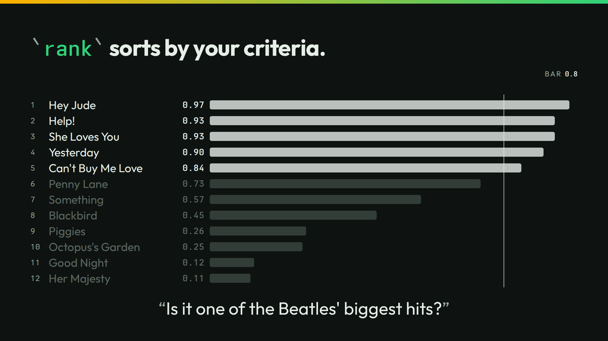

# rank



The slide sorts twelve songs by how likely each is one of the Beatles' biggest hits. `rank` returns the songs in order, each with its probability.

## Run it

```sh
./run
```

```json
{"song":"Hey Jude","yes":0.97,"over":true}
{"song":"Help!","yes":0.93,"over":true}
{"song":"She Loves You","yes":0.93,"over":true}
{"song":"Yesterday","yes":0.9,"over":true}
{"song":"Can't Buy Me Love","yes":0.84,"over":true}
{"song":"Penny Lane","yes":0.73,"over":false}
{"song":"Something","yes":0.57,"over":false}
{"song":"Blackbird","yes":0.45,"over":false}
{"song":"Piggies","yes":0.26,"over":false}
{"song":"Octopus's Garden","yes":0.25,"over":false}
{"song":"Good Night","yes":0.12,"over":false}
{"song":"Her Majesty","yes":0.11,"over":false}
```

rank has no bar of its own. Here `jq` applies one, and `over` marks each song at the bar or over. `./run` uses the slide's bar of `0.8`. Another bar moves the line:

```sh
./run threshold 0.5
```

```json
{"song":"Hey Jude","yes":0.97,"over":true}
{"song":"Help!","yes":0.93,"over":true}
{"song":"She Loves You","yes":0.93,"over":true}
{"song":"Yesterday","yes":0.9,"over":true}
{"song":"Can't Buy Me Love","yes":0.84,"over":true}
{"song":"Penny Lane","yes":0.73,"over":true}
{"song":"Something","yes":0.57,"over":true}
{"song":"Blackbird","yes":0.45,"over":false}
{"song":"Piggies","yes":0.26,"over":false}
{"song":"Octopus's Garden","yes":0.25,"over":false}
{"song":"Good Night","yes":0.12,"over":false}
{"song":"Her Majesty","yes":0.11,"over":false}
```

`./run live` asks your own server. It sends 12 calls.

## The lessons

- **You control the bar.** At `0.8`, five songs sit over the line. At `0.5`, seven do.
- **The number is the number.** Help! and She Loves You tie at 0.93. Their order says nothing. The numbers carry the ranking.

## The files

- `rank-cold.jsonl`: the cases.
- `lists/`: the ranked list.
- `outputs.jsonl`, `timing.tsv`, and `recording/`: the recorded answers.
- `run.txt`: the thinkthen build and the model that recorded the answers.

The talk's page for this slide: [thinkthen.dev/learn/beatles-bench/rank](https://thinkthen.dev/learn/beatles-bench/rank/).
