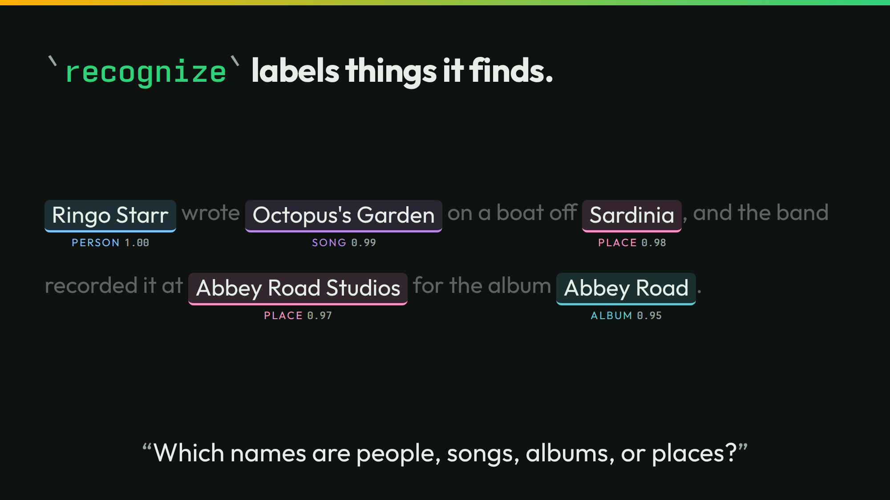

# recognize



The slide finds the people, songs, albums, and places in one sentence. `recognize` names each span, its kind, and a strength. `./run` keeps every name at `0.01` or more.

These answers are historical. The pinned build, thinkthen main at 02dc0b96, recorded them with an earlier recognize planner. `thinkthen 0.1.0` asks different questions for the same sentence, so this recording replays only under that build.

## Run it

```sh
./run
```

```json
{"name":"Ringo Starr","kind":"person","start":0,"end":11,"strength":1.0}
{"name":"Octopus's Garden","kind":"song","start":18,"end":34,"strength":0.99}
{"name":"Sardinia","kind":"place","start":49,"end":57,"strength":0.98}
{"name":"Abbey Road Studios","kind":"place","start":87,"end":105,"strength":0.9735}
{"name":"Abbey Road","kind":"album","start":120,"end":130,"strength":0.9504}
```

A higher bar keeps fewer names:

```sh
./run threshold 0.99
```

```json
{"name":"Ringo Starr","kind":"person","start":0,"end":11,"strength":1.0}
{"name":"Octopus's Garden","kind":"song","start":18,"end":34,"strength":0.99}
```

`./run live` asks your own server. It sends one call.

## The lessons

- **You control the bar.** At `0.99`, only Ringo Starr and Octopus's Garden stay.
- **The number is the number.** The same words, Abbey Road, name an album at 0.9504 and part of a place at 0.9735. Each span gets its own kind and strength.

## The files

- `recognize-cold.jsonl`: the case.
- `outputs.jsonl`, `timing.tsv`, and `recording/`: the recorded answers.
- `run.txt`: the thinkthen build and the model that recorded the answers.

The talk's page for this slide: [thinkthen.dev/learn/beatles-bench/recognize](https://thinkthen.dev/learn/beatles-bench/recognize/).
