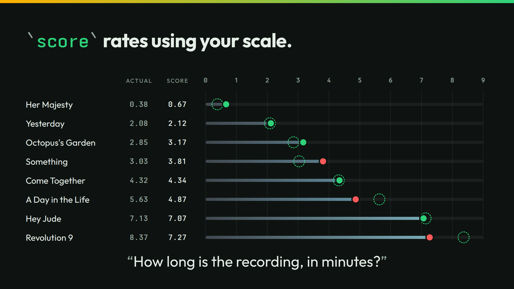

# score



The slide asks how long eight recordings are, on a scale from about 0 to about 9 minutes. `score` gives a value on your scale and the likeliest level with its probability.

## Run it

```sh
./run
```

```json
{"song":"Her Majesty","minutes":0.67,"level":"about 0 minutes","p":0.46}
{"song":"Yesterday","minutes":2.12,"level":"about 2 minutes","p":0.86}
{"song":"Octopus's Garden","minutes":3.17,"level":"about 3 minutes","p":0.71}
{"song":"Something","minutes":3.81,"level":"about 3 minutes","p":0.39}
{"song":"Come Together","minutes":4.34,"level":"about 4 minutes","p":0.52}
{"song":"A Day in the Life","minutes":4.868686868687,"level":"about 5 minutes","p":0.68}
{"song":"Hey Jude","minutes":7.07,"level":"about 7 minutes","p":0.75}
{"song":"Revolution 9","minutes":7.27,"level":"about 9 minutes","p":0.37}
```

score has no bar of its own. Here `jq` applies one. A level under the bar reads null, as not sure:

```sh
./run threshold 0.5
```

```json
{"song":"Her Majesty","minutes":0.67,"level":null,"p":0.46}
{"song":"Yesterday","minutes":2.12,"level":"about 2 minutes","p":0.86}
{"song":"Octopus's Garden","minutes":3.17,"level":"about 3 minutes","p":0.71}
{"song":"Something","minutes":3.81,"level":null,"p":0.39}
{"song":"Come Together","minutes":4.34,"level":"about 4 minutes","p":0.52}
{"song":"A Day in the Life","minutes":4.868686868687,"level":"about 5 minutes","p":0.68}
{"song":"Hey Jude","minutes":7.07,"level":"about 7 minutes","p":0.75}
{"song":"Revolution 9","minutes":7.27,"level":null,"p":0.37}
```

`./run live` asks your own server. It sends 8 calls.

## The lessons

- **You control the bar.** Your program sets the bar for score. At `0.5`, Her Majesty, Something, and Revolution 9 read not sure.
- **The number is the number.** Revolution 9 scores 7.27 minutes. Its likeliest level is about 9 minutes, at 0.37. The value weighs every level. Read it as the model gave it.

## The files

- `score-cold.jsonl` and `score-context.jsonl`: the cases, cold and with each song's catalog entry.
- `outputs.jsonl`, `timing.tsv`, and `recording/`: the recorded answers.
- `run.txt`: the thinkthen build and the model that recorded the answers. Replayed under thinkthen 0.1.0, `checkpoint/surfaces/2026-10-02-1` (`4e880cdf6`), on 2026-10-02: no answer changed.

The talk's page for this slide: [thinkthen.dev/learn/beatles-bench/score](https://thinkthen.dev/learn/beatles-bench/score/).
