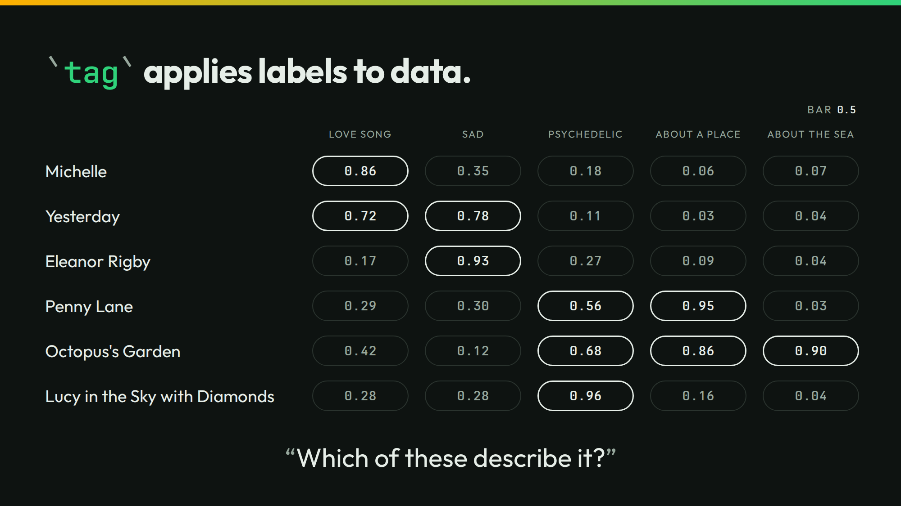

# tag



The slide asks which of five labels fit six songs. `tag` gives each label its own probability. It keeps every label at the bar or over.

## Run it

```sh
./run
```

```json
{"song":"Michelle","tags":["love song"],"p":{"love song":0.86,"sad":0.35,"psychedelic":0.18,"about a place":0.06,"about the sea":0.07}}
{"song":"Yesterday","tags":["love song","sad"],"p":{"love song":0.72,"sad":0.78,"psychedelic":0.11,"about a place":0.03,"about the sea":0.04}}
{"song":"Eleanor Rigby","tags":["sad"],"p":{"love song":0.17,"sad":0.93,"psychedelic":0.27,"about a place":0.09,"about the sea":0.04}}
{"song":"Penny Lane","tags":["psychedelic","about a place"],"p":{"love song":0.29,"sad":0.3,"psychedelic":0.56,"about a place":0.95,"about the sea":0.03}}
{"song":"Octopus's Garden","tags":["psychedelic","about a place","about the sea"],"p":{"love song":0.42,"sad":0.12,"psychedelic":0.68,"about a place":0.86,"about the sea":0.9}}
{"song":"Lucy in the Sky with Diamonds","tags":["psychedelic"],"p":{"love song":0.28,"sad":0.28,"psychedelic":0.96,"about a place":0.16,"about the sea":0.04}}
```

A higher bar keeps fewer labels:

```sh
./run threshold 0.7
```

```json
{"song":"Michelle","tags":["love song"],"p":{"love song":0.86,"sad":0.35,"psychedelic":0.18,"about a place":0.06,"about the sea":0.07}}
{"song":"Yesterday","tags":["love song","sad"],"p":{"love song":0.72,"sad":0.78,"psychedelic":0.11,"about a place":0.03,"about the sea":0.04}}
{"song":"Eleanor Rigby","tags":["sad"],"p":{"love song":0.17,"sad":0.93,"psychedelic":0.27,"about a place":0.09,"about the sea":0.04}}
{"song":"Penny Lane","tags":["about a place"],"p":{"love song":0.29,"sad":0.3,"psychedelic":0.56,"about a place":0.95,"about the sea":0.03}}
{"song":"Octopus's Garden","tags":["about a place","about the sea"],"p":{"love song":0.42,"sad":0.12,"psychedelic":0.68,"about a place":0.86,"about the sea":0.9}}
{"song":"Lucy in the Sky with Diamonds","tags":["psychedelic"],"p":{"love song":0.28,"sad":0.28,"psychedelic":0.96,"about a place":0.16,"about the sea":0.04}}
```

`./run live` asks your own server. It sends 6 calls.

## The lessons

- **You control the bar.** At the default bar of `0.5`, Penny Lane is psychedelic at 0.56. At `0.7` that label drops.
- **The number is the number.** Octopus's Garden is about the sea at 0.9 and about a place at 0.86. Each label stands on its own. The numbers need not add to 1.

## The files

- `tag-cold.jsonl`: the cases.
- `outputs.jsonl`, `timing.tsv`, and `recording/`: the recorded answers.
- `run.txt`: the thinkthen build and the model that recorded the answers. Replayed under thinkthen 0.1.0, `checkpoint/surfaces/2026-10-02-1` (`4e880cdf6`), on 2026-10-02: no answer changed.

The talk's page for this slide: [thinkthen.dev/learn/beatles-bench/tag](https://thinkthen.dev/learn/beatles-bench/tag/).
