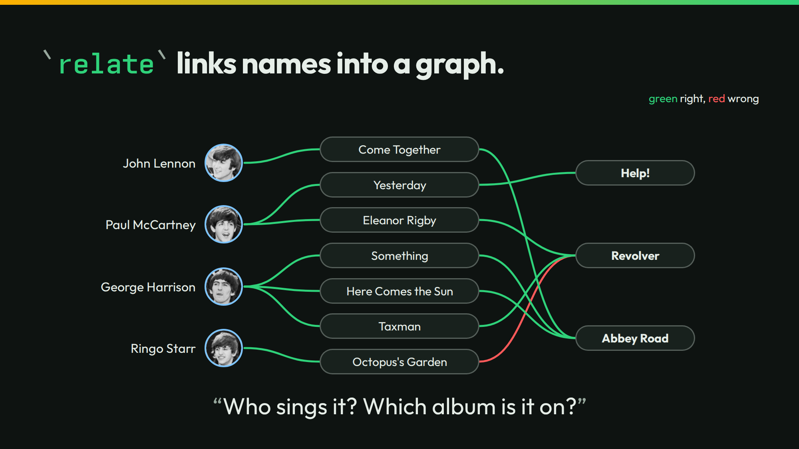

# relate



The slide links seven songs to singers and albums. `relate.json` names the two relations, `sung_by` and `appears_on`. `relate` gives each possible edge a probability. `./run` keeps the edges at `0.5` or more, as the slide does.

## Run it

```sh
./run
```

```json
["sung_by","Octopus's Garden","Ringo Starr",0.97]
["sung_by","Something","George Harrison",0.81]
["sung_by","Come Together","John Lennon",0.89]
["sung_by","Here Comes the Sun","George Harrison",0.93]
["sung_by","Yesterday","Paul McCartney",0.93]
["sung_by","Eleanor Rigby","Paul McCartney",0.81]
["sung_by","Taxman","George Harrison",0.8]
["appears_on","Octopus's Garden","Revolver",0.73]
["appears_on","Something","Abbey Road",1.0]
["appears_on","Come Together","Abbey Road",1.0]
["appears_on","Here Comes the Sun","Abbey Road",1.0]
["appears_on","Yesterday","Help!",0.56]
["appears_on","Eleanor Rigby","Revolver",0.99]
["appears_on","Taxman","Revolver",0.96]
```

A lower bar shows the edges under `0.5`. Here are Yesterday's:

```sh
./run threshold 0.01 | grep Yesterday
```

```json
["sung_by","Yesterday","John Lennon",0.01]
["sung_by","Yesterday","Paul McCartney",0.93]
["appears_on","Yesterday","Abbey Road",0.01]
["appears_on","Yesterday","Help!",0.56]
["appears_on","Yesterday","Revolver",0.3]
```

`./run live` asks your own server. It sends 2 calls.

## The lessons

- **You control the bar.** At `0.5`, Yesterday links to Paul McCartney and to Help!. At `0.01`, Revolver joins at 0.3.
- **The number is the number.** Yesterday's edge to Help! is 0.56. It is right, and barely over the bar. Octopus's Garden links to Revolver at 0.73. It is wrong. The song is on Abbey Road.

## The files

- `relate.json`: the two relations.
- `relate-cold.jsonl`: the case, with its names.
- `outputs.jsonl`, `timing.tsv`, and `recording/`: the recorded answers.
- [The walkthrough](../../docs/walkthroughs/relate.md) shows how the example was built and why each answer is right or wrong.

The talk's page for this slide: [thinkthen.dev/learn/beatles-bench/relate](https://thinkthen.dev/learn/beatles-bench/relate/).
